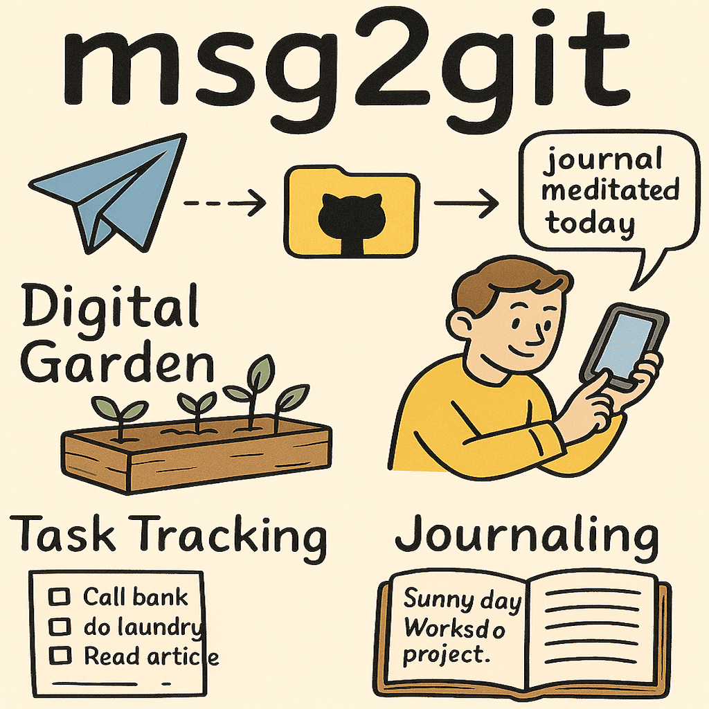

# 📝 Msg2Git

> **Transform Telegram into your personal git-powered notebook.** A powerful open-source bot that turns your messages into organized GitHub commits with AI assistance, issue management, and advanced analytics.

> 🌐 **Try it now**: [@Msg2GitBot](https://t.me/Msg2GitBot) | 🏠 **Self-host**: Deploy your own instance | 📖 **Homepage**: [www.msg2git.com](https://www.msg2git.com)

🎥 **Watch 8-minute Demo Video** - See all features in action! 👇
[](https://www.youtube.com/watch?v=OJGsxP-D6VM)

[](https://github.com/msg2git/msg2git/stargazers)
[](https://hub.docker.com/r/msg2git/msg2git)
[](https://opensource.org/licenses/MIT)
[](https://goreportcard.com/report/github.com/msg2git/msg2git)

## 🎆 Quick Start

### 📱 **Try the Hosted Version** (Easiest)
1. **Start the bot**: [@Msg2GitBot](https://t.me/Msg2GitBot)
2. **Setup repository**: `/repo` command to connect your GitHub
3. **Send messages**: Text, photos, ideas - organized automatically
4. **Upgrade if needed**: `/coffee` for premium features

### 🐳 **Self-Host with Docker** (Recommended for control)
```bash
git clone https://github.com/msg2git/msg2git.git
cd msg2git
vim .minimal.env  # Settle your tokens
docker-compose up
```

### 🛠️ **Manual Installation**
```bash
git clone https://github.com/msg2git/msg2git.git
cd msg2git
cp .prod.env .env ; cat .minimal.env >> .env
vim .env # Settle your tokens
go mod tidy
go run main.go
```

---

## 🚀 Core Features

- **📨 Smart Message Processing**: Send text, photos, and captions with interactive file selection
- **📸 Photo Support & CDN**: Upload photos directly with automatic GitHub CDN storage
- **✅ TODO Management**: Interactive numbered TODOs with completion buttons
- **❓ GitHub Issue Integration**: Create and manage GitHub issues directly from Telegram
- **📊 Analytics & Insights**: 30-day commit graphs and usage statistics
- **🔐 Multi-User & Security**: Database-driven with encrypted user data and premium tiers
- **🎨 Enhanced UX**: Progress bars, message editing, mobile-optimized layouts
- **🔄 Performance**: File-level locking, worker pools, race condition protection

---

## 🛠️ How It Works

1. **Message the Bot**: Send any text message to your configured Telegram bot
2. **Choose Location**: Select file type using interactive buttons (📝 NOTE, ✅ TODO, ❓ ISSUE, 💡 IDEA, 📥 INBOX, 🔧 TOOL)
3. **AI Processing**: Bot generates title and hashtags (if LLM configured)
4. **Git Operations**: Pulls latest changes, prepends your message, commits and pushes
5. **Success Feedback**: Get confirmation with GitHub file link

### File Format Examples

**Regular Files**:
```markdown
<!--[123] [456789] [2025-06-25 14:30]-->
## Meeting Notes Discussion
#productivity #ideas
Had a great discussion about the new product features...
```

**TODOs**:
```markdown
- [ ] <!--[123] [456789]--> Review pull request documentation (2025-06-25)
- [x] <!--[122] [456789]--> Update README with new features (2025-06-24)
```

---

## 🤖 Commands

For the complete list of commands and features, message the bot:
- `/start` - Welcome message and quick setup guide
- `/help` - Detailed help with all available commands

**Essential Commands**: `/llm`, `/repo`, `/todo`, `/issue`, `/insight`, `/stats`

---

## 🎯 Setup Guide

### 1. **Create Telegram Bot**
1. Message [@BotFather](https://t.me/BotFather) on Telegram
2. Use `/newbot` command and save the bot token

### 2. **GitHub Setup**
1. Create a GitHub repository for your notes
2. Generate Personal Access Token with `repo` scope
3. Ensure Contents, Issues, and Releases permissions are enabled

### 3. **LLM Setup (Optional)**
Get API key from [DeepSeek Platform](https://platform.deepseek.com/) for AI-powered title generation

---

## 🏗️ Architecture

```
┌─────────────────┐    ┌──────────────────┐    ┌─────────────────┐
│   Telegram Bot  │◄──►│   msg2git App   │◄──►│   GitHub API    │
│                 │    │                  │    │                 │
│ • Rate Limited  │    │ • Multi-user     │    │ • Auto-sync     │
│ • Progress Bars │    │ • Photo CDN      │    │ • Issue Mgmt    │
│ • Interactive   │    │ • AI Processing  │    │ • Git Ops       │
└─────────────────┘    └──────────────────┘    └─────────────────┘
                                │
                                ▼
                       ┌─────────────────┐
                       │   PostgreSQL    │
                       │                 │
                       │ • User Data     │
                       │ • Encrypted     │
                       │ • Multi-tenant  │
                       └─────────────────┘
```

---

## 🔒 Security & Performance

### **Security**
- Token encryption with database storage
- Per-user repository isolation
- Tiered storage limits (1MB-10MB based on plan)

### **Performance**
- File-level locking for concurrent operations
- Worker pool architecture (35 message + 30 callback workers)
- Rate limiting and auto-cleanup mechanisms

---

## 🤝 Contributing

1. Fork the repository
2. Create feature branch (`git checkout -b feature/amazing-feature`)
3. Commit changes (`git commit -m 'Add amazing feature'`)
4. Push to branch (`git push origin feature/amazing-feature`)
5. Open a Pull Request

---

## 📄 License

MIT License - see [LICENSE](LICENSE) file for details.

Attribution Requirement: Any public deployment or commercial use of this software
must include visible attribution "Powered by Msg2Git" with a link to 
https://msg2git.com in the user interface or documentation.

---

## All Commands (for bot father)
start - Show welcome message                        
help - Show help message
llm - Manage AI features
repo - Manage personal repo
sync - Synchronize issue statuses                        
todo - Show latest TODO items                            
issue - Show latest open issues                          
insight - View usage statistics and insights             
stats - View global bot statistics
customfile - Manage custom files                         
resetusage - Reset usage counters (paid service)         
coffee - Support the project and unlock premium features 

---
**Made with ❤️ for digital gardeners, note-takers, and productivity enthusiasts.**
