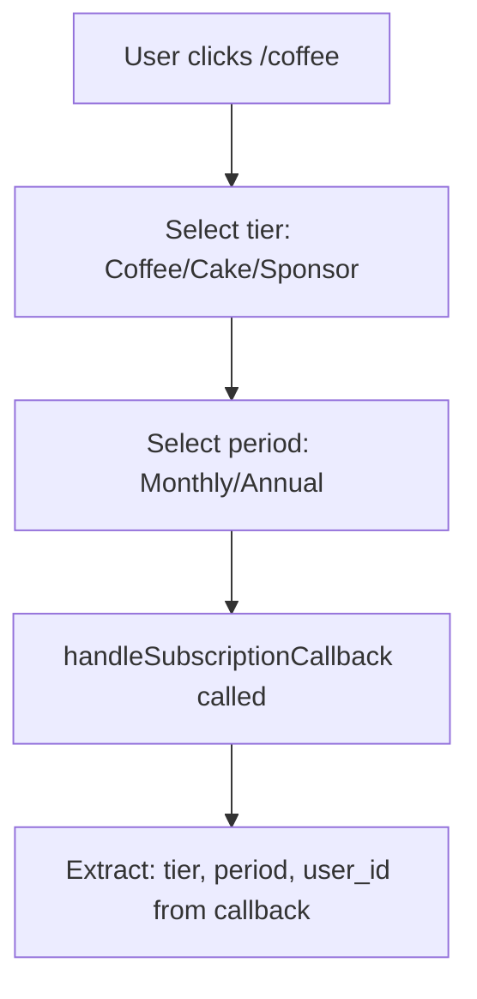
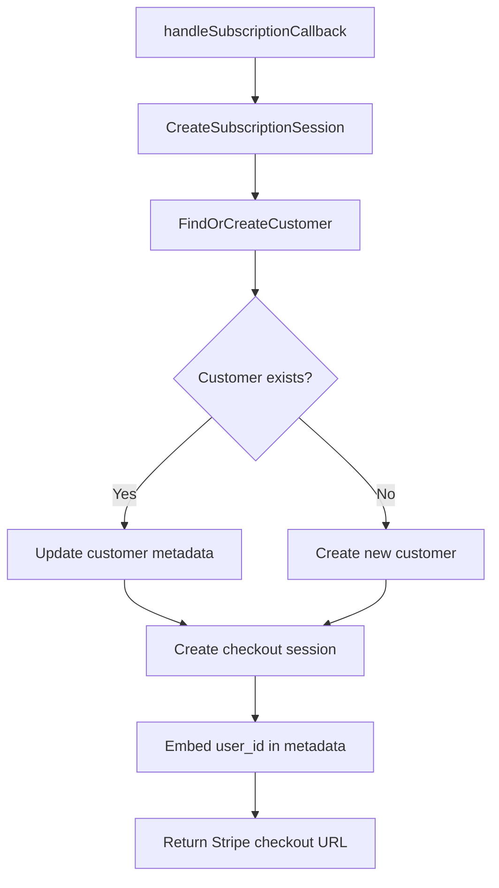
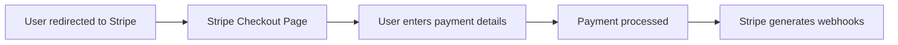
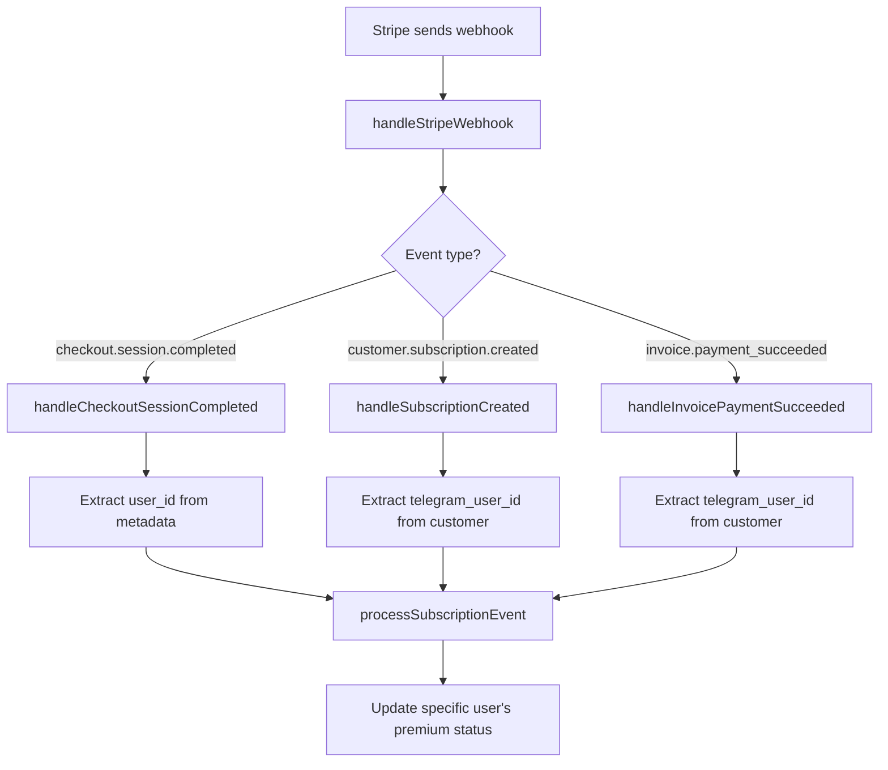
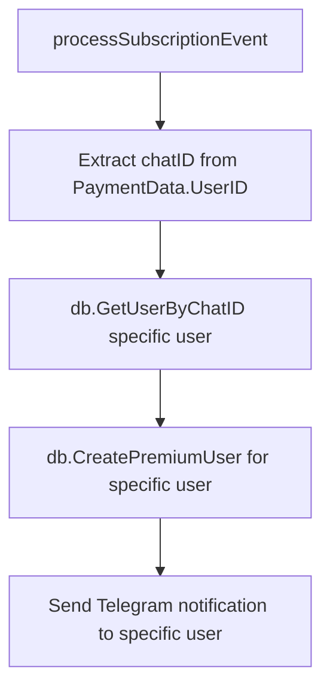
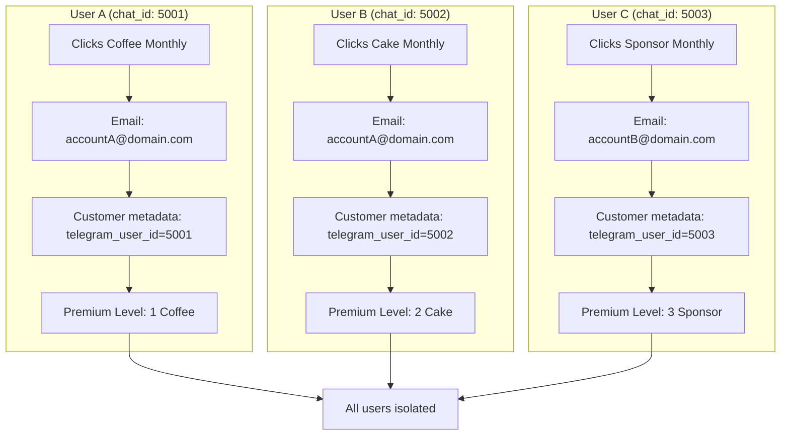
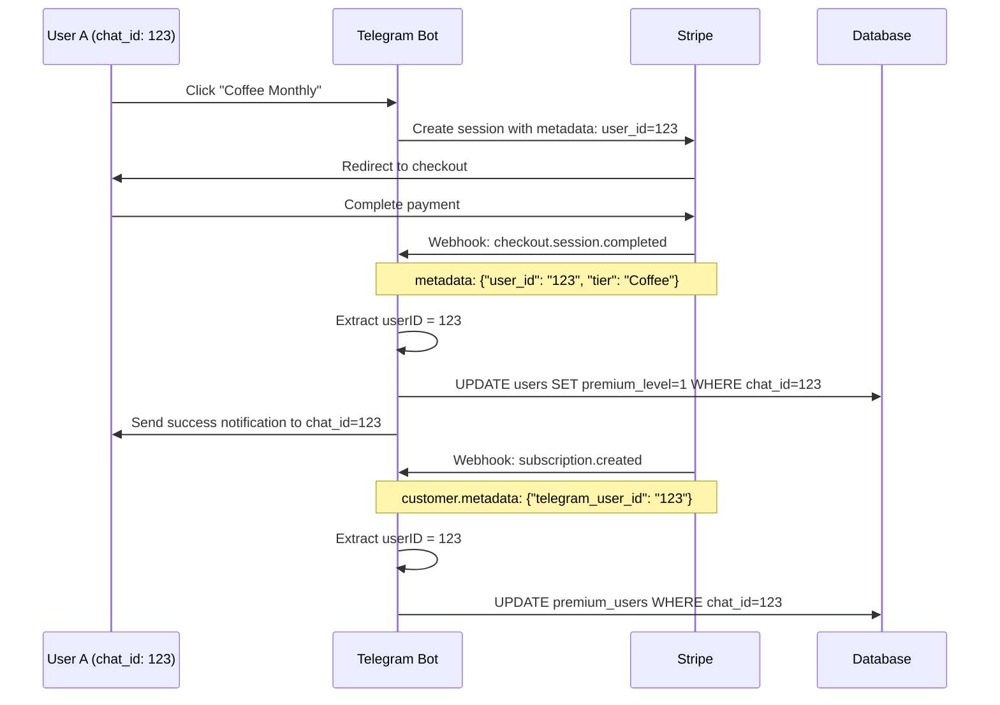
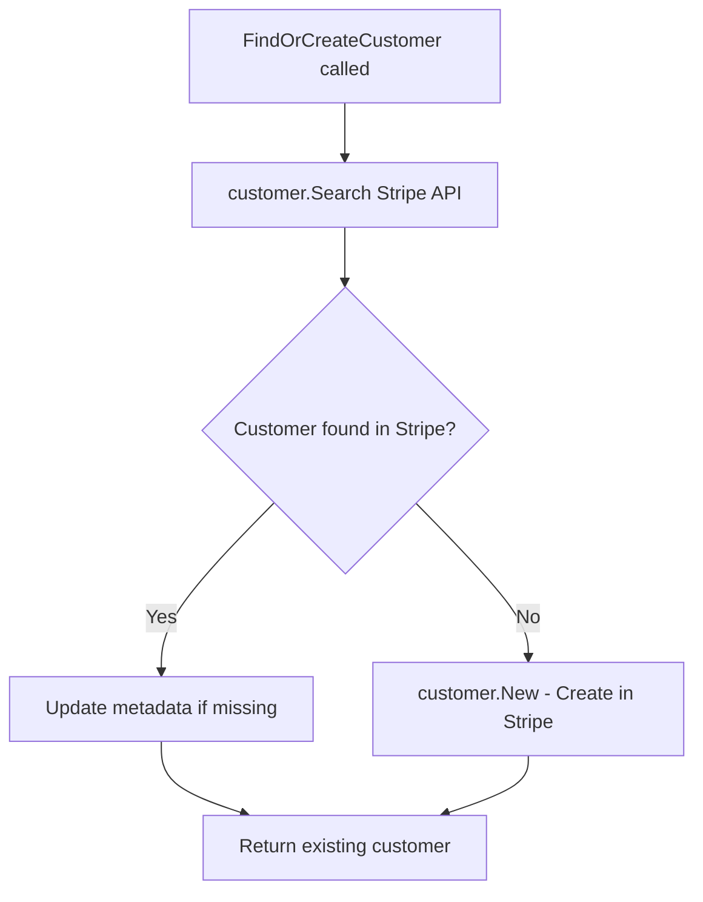
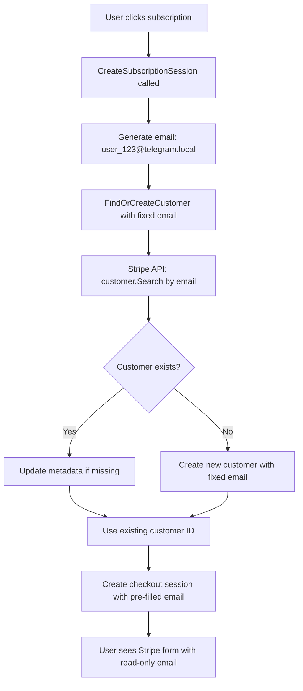

# Stripe Payment Flow Analysis

This document analyzes the complete Stripe payment flow in the msg2git system, focusing on user isolation and how payments are connected to specific Telegram users.

## Overview

The msg2git system uses Stripe for handling premium subscriptions with complete user isolation. Multiple users can use the same Stripe account/email without affecting each other's premium status.

## Complete Payment Flow

### 1. User Initiates Payment



**Code Location:** `/internal/telegram/callback_payments.go:68-108`

```go
// Parse subscription callback data: subscription_{tier}_{period}
parts := strings.Split(callback.Data, "_")
tier := parts[1]   // coffee, cake, sponsor
period := parts[2] // monthly, annual
```

### 2. Stripe Session Creation



**Code Location:** `/internal/stripe/sessions.go:42-111`

#### Customer Creation Logic:
- **Email Format:** `user_{telegram_id}@telegram.local` (e.g., `user_123@telegram.local`)
- **Customer Metadata:** `{"telegram_user_id": "123"}`
- **Session Metadata:**
  ```go
  Metadata: map[string]string{
      "user_id":        "123",           // Telegram chat_id
      "payment_type":   "subscription",
      "tier_name":      "☕ Coffee", 
      "premium_level":  "1",
      "billing_period": "monthly",
  }
  ```

### 3. User Payment via Stripe



### 4. Webhook Processing



**Code Location:** `/internal/stripe/webhooks.go:95-178`

#### User Identification in Webhooks:

**From Session Metadata:**
```go
// Extract from checkout session
userIDStr, exists := session.Metadata["user_id"]
userID, err := strconv.ParseInt(userIDStr, 10, 64)
```

**From Customer Metadata:**
```go
// Extract from subscription customer
userIDStr, exists := subscription.Customer.Metadata["telegram_user_id"]
```

### 5. Database Update (User-Specific)



**Code Location:** `/internal/telegram/stripe_payments.go:266-366`

```go
// Convert Telegram user ID to chat ID
chatID := paymentData.UserID  // e.g., 123

// Get specific user's record
user, err := b.db.GetUserByChatID(chatID)

// Update only this user's premium status
_, err = b.db.CreatePremiumUser(chatID, user.Username, premiumLevel, expireAt)
```

## User Isolation Example

### Scenario: Multiple Users, Same/Different Stripe Accounts



### Database State After Payments:

| chat_id | email | premium_level | tier | subscription_id |
|---------|--------|---------------|------|-----------------|
| 5001 | accountA@domain.com | 1 | ☕ Coffee | sub_abc123 |
| 5002 | accountA@domain.com | 2 | 🍰 Cake | sub_def456 |
| 5003 | accountB@domain.com | 3 | 🎁 Sponsor | sub_ghi789 |

**Key Point:** Same email (accountA@domain.com) for Users A & B, but completely isolated premium statuses.

## Key Isolation Mechanisms

### 1. Metadata-Based User Identification

Every Stripe object carries the Telegram user ID:

```json
{
  "checkout_session": {
    "metadata": {
      "user_id": "123"
    }
  },
  "customer": {
    "metadata": {
      "telegram_user_id": "123"
    }
  }
}
```

### 2. Multiple Customers Per Email Support

**Code Location:** `/internal/stripe/sessions.go:144-191`

```go
// Search for existing customer by email
searchParams.Query = fmt.Sprintf("email:'%s'", email)

// Even if email exists, create/update with unique telegram_user_id
customerParams := &stripe.CustomerParams{
    Email: stripe.String(email),
    Metadata: map[string]string{
        "telegram_user_id": strconv.FormatInt(userID, 10),
    },
}
```

### 3. Database Isolation by chat_id

All database operations use `chat_id` as the isolation key:

```sql
-- User-specific operations
UPDATE users SET premium_level = ? WHERE chat_id = ?
SELECT * FROM users WHERE chat_id = ?
INSERT INTO premium_users (chat_id, ...) VALUES (?, ...)
```

## Webhook Event Flow



## Security & Isolation Guarantees

### ✅ Complete User Isolation
- **Session Level:** Each session embeds the specific user's Telegram ID
- **Customer Level:** Each customer record includes unique `telegram_user_id` metadata
- **Webhook Level:** User identification extracted from metadata, not email
- **Database Level:** All updates use `chat_id` as the primary isolation key

### ✅ No Cross-User Interference
- User A's payment cannot affect User B's premium status
- Multiple users can share the same Stripe account/email safely
- Subscription cancellation affects only the specific user's subscription
- Billing portal access is customer-specific, not email-specific

### ✅ Error Handling
```go
// Webhook fails gracefully if user_id missing
userIDStr, exists := session.Metadata["user_id"]
if !exists {
    return nil, fmt.Errorf("user_id not found in session metadata")
}
```

## File Structure

### Key Files:
- **`/internal/telegram/callback_payments.go`** - Handles user clicks and tier selection
- **`/internal/stripe/sessions.go`** - Creates Stripe sessions with user metadata
- **`/internal/stripe/webhooks.go`** - Processes webhooks and extracts user IDs
- **`/internal/stripe/webhook_subscriptions.go`** - Handles subscription-specific events
- **`/internal/telegram/stripe_payments.go`** - Updates user-specific database records

### Database Tables:
- **`users`** - Main user records (chat_id as primary key)
- **`premium_users`** - Premium subscription details (chat_id as foreign key)
- **`user_topup_log`** - Payment history (chat_id for isolation)

## FAQ: Technical Implementation Details

### Q1: Is `user_{telegram_id}@telegram.local` formatted email used to extract user_id?

**Answer: Yes, but only as a fallback mechanism.**

#### Primary Method (Preferred):
The system primarily uses **metadata** to identify users:
```go
// From customer.metadata  
userIDStr, exists := customer.Metadata["telegram_user_id"]
```

#### Fallback Method (When metadata missing):
If metadata is missing, it extracts from the email format:
```go
// From webhook_subscriptions.go:192-194
if strings.HasPrefix(fullCustomer.Email, "user_") && strings.HasSuffix(fullCustomer.Email, "@telegram.local") {
    emailUserID := strings.TrimPrefix(fullCustomer.Email, "user_")
    emailUserID = strings.TrimSuffix(emailUserID, "@telegram.local")
    userID, err = strconv.ParseInt(emailUserID, 10, 64)
}
```

**Example:**
- Email: `user_123@telegram.local`
- Extracted user_id: `123`

This fallback exists to handle customers created before the metadata system was implemented.

### Q2: Where does `sm.FindOrCreateCustomer` find customer info, from database or Stripe?

**Answer: From Stripe directly, NOT from local database.**



**Process:**
```go
// From sessions.go:150-153
searchParams := &stripe.CustomerSearchParams{}
searchParams.Query = fmt.Sprintf("email:'%s'", email)
searchResult := customer.Search(searchParams)  // ← This calls Stripe API
```

1. **Search Stripe** using `customer.Search()` API call
2. **Query by email** in Stripe's customer database
3. **If found:** Update metadata if missing, return existing customer
4. **If not found:** Create new customer in Stripe using `customer.New()`

**No local database involved** - it's purely Stripe-to-Stripe customer management.

### Q3: When creating customer, can user change email?

**Answer: No, users cannot change the email during the payment process.**

#### Email is Hardcoded:
```go
// From sessions.go:84
customer, err := sm.FindOrCreateCustomer(userID, fmt.Sprintf("user_%d@telegram.local", userID))
```

The email is **automatically generated** as `user_{telegram_id}@telegram.local` and **hardcoded** in the session creation.

#### Customer Creation Flow:


#### What Users Experience:
- **Stripe Checkout Page:** Email field shows `user_123@telegram.local` (read-only)
- **Payment Form:** Users enter card details, address, etc.
- **No email editing** capability provided

#### Technical Implementation:
```go
// From sessions.go:183-189
customerParams := &stripe.CustomerParams{
    Email: stripe.String(email),  // ← Fixed email, not user-provided
    Metadata: map[string]string{
        "telegram_user_id": strconv.FormatInt(userID, 10),
    },
}
```

### Summary Table

| Question | Answer | Details |
|----------|---------|---------|
| **Email format for user_id extraction?** | ✅ **Yes (fallback only)** | Primary: metadata, Fallback: parse `user_123@telegram.local` |
| **Customer search: Database or Stripe?** | **Stripe API directly** | Uses `customer.Search()` API, no local DB |
| **Can user change email?** | ❌ **No** | Email is hardcoded as `user_{id}@telegram.local` |

## Conclusion

The msg2git Stripe integration provides **complete user isolation** through:

1. **Metadata embedding** at session creation
2. **User-specific customer management** with unique `telegram_user_id`
3. **Webhook processing** that extracts and uses Telegram user IDs
4. **Database operations** isolated by `chat_id`
5. **Dual identification system** (metadata primary, email fallback)
6. **Stripe-only customer management** (no local customer database)
7. **Fixed email system** preventing user email changes

**Result:** Multiple users can safely use the same Stripe account/email without any interference with each other's premium status or billing.